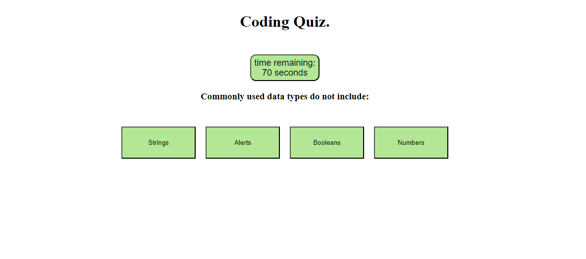

# JavaScript Coding Quiz App

## Description

With the aim of implementing all the knowledge aquired over the previous four weeks of my coding bootcamp, I was set the task of creating a web application using Javascript, CSS and HTML to quiz my knowledge of Javascript. 

Although the question are simple enough, the real learning value has come from building, debugging, and then further refining my code in order to more deeply understand just how Javascript runs within the web browser.

## Usage

Click "Start Quiz" to begin the quiz. Answer all questions and then follow the prompts to either log your scores or return back to the beginning without saving them.

link to the deployed application: https://jlp-55.github.io/Code-quiz-app/

## Images

## Licence

MIT License

Copyright (c) 2023 JLP-55

Permission is hereby granted, free of charge, to any person obtaining a copy
of this software and associated documentation files (the "Software"), to deal
in the Software without restriction, including without limitation the rights
to use, copy, modify, merge, publish, distribute, sublicense, and/or sell
copies of the Software, and to permit persons to whom the Software is
furnished to do so, subject to the following conditions:

The above copyright notice and this permission notice shall be included in all
copies or substantial portions of the Software.

THE SOFTWARE IS PROVIDED "AS IS", WITHOUT WARRANTY OF ANY KIND, EXPRESS OR
IMPLIED, INCLUDING BUT NOT LIMITED TO THE WARRANTIES OF MERCHANTABILITY,
FITNESS FOR A PARTICULAR PURPOSE AND NONINFRINGEMENT. IN NO EVENT SHALL THE
AUTHORS OR COPYRIGHT HOLDERS BE LIABLE FOR ANY CLAIM, DAMAGES OR OTHER
LIABILITY, WHETHER IN AN ACTION OF CONTRACT, TORT OR OTHERWISE, ARISING FROM,
OUT OF OR IN CONNECTION WITH THE SOFTWARE OR THE USE OR OTHER DEALINGS IN THE
SOFTWARE.
